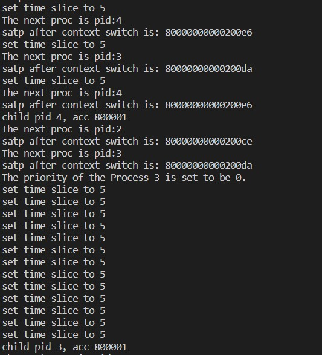
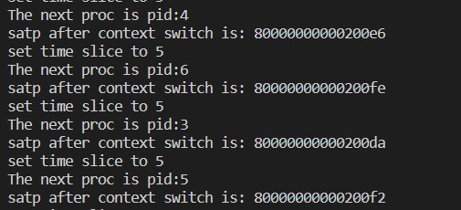

## CS334 Project Report

[TOC]

### 成员及负责工作

| 成员           | 负责工作                                                     |
| -------------- | ------------------------------------------------------------ |
| @Cobalt-27     | 基于Sv39 设计了虚拟地址和物理地址的划分格式以及虚拟地址到物理地址的转换模式，实现了16KOS 以及 CFS， 报告 |
| @Leo-Adventure | 物理内存分配算法(first fit, worst fit 以及 best fit, next fit)以及进程管理(RR)，报告 |

### 物理地址和虚拟地址格式与转换

地址格式类似SV39，采用9+9+9+14的布局。

初始化页表将`VA: 0xffffffff_00000000`开头的4GB页映射到`0x0`开头的低地址4GB页，从而使得`VA Base: 0xffffffff_80200000`能正确的映射到`PA Base: 0x80200000`。

于此同时，在初始化时`entry.S`会创建Identity Mapping来安全的切换至虚拟内存模式，并且在随后清除Identity Mapping。

```
boot_page_table_sv39:
    .quad 0xcf #Identity mapping
    .zero 8 * 510
    # 设置最后一个页表项，PPN=0x00000，标志位 VRWXAD 均为 1
    .quad (0x00000 << 10) | 0xcf # VRWXAD
```

下图展示了在本次project 当中，我们的物理地址和虚拟地址的格式以及转换方式


### 16K OS 整体架构说明

##### 虚拟内存

在`entry.S`中初始化页表，采用16k页，实现了`first fit`,`best fit`,`worst fit`三种内存分配算法。

为每个进程分配独立的虚拟内存空间。

##### 进程调度

实现了上下文切换，`RoundRobin`以及`CFS`两种调度算法。

##### 实验

对Instruction Cache机制进行了实验

### Qemu 修改部分

修改了qemu中关于offset的常量。

修改部分如代码截图所示


### 物理内存分配及测试

在物理内存分配算法上面，我们实现了基于 16KOS 的四种物理内存分配算法。分别是`first fit`,`best fit`、`worst fit`以及 `next fit`

对于 `best fit`，代码思路是在需要分配 `n` 页的时候，遍历一遍所有的空闲块，找到空闲块大小最接近 `n`的空闲块，之后从这个空闲块当中分配出 `n` 个页面。

主要代码如下

```cpp
static struct Page *
best_fit_alloc_pages(size_t n) {
    ...init vars...
    while ((le = list_next(le)) != &free_list) { // 循环直到找到一个符合大小条件的页面
        struct Page *p = le2page(le, page_link);
        if (p->property >= n) { 
            if(p->property<best){//best fit
                best=p->property;
                page = p; // 记录符合条件的页面
            }
        }
    }
    ...set page properties...
    return page;
}
```

运行测试的结果如下：


对于 `worst fit`，代码思路是在需要分配 `n` 页的时候，遍历一遍所有的空闲块，找到空闲块大小最不接近 `n`的空闲块，之后从这个空闲块当中分配出 `n` 个页面。

主要部分的代码如下

```c

static struct Page *
worst_fit_alloc_pages(size_t n)
{
    ...init vars...
    while ((le = list_next(le)) != &free_list)
    {
        struct Page *p = le2page(le, page_link);
        if (p->property >= n)
        {
            if (p->property > worst)
            { // worst fit
                worst = p->property;
                page = p;
            }
            // if (p->property >= n) {
            //     page = p;
            //     break;
            // }
        }
    }
    ...set page properties...
    return page;
}

```

运行之后，可以通过所有的测试，效果截图如下：


对于实现的 `next_fit`算法，基本思想是记录每一次分配的页面的空闲块所在的位置，下一次从这里开始遍历，而不是每一次都从 `free_list`的队首开始遍历。

代码主要部分实现如下：
```c

static struct Page *
next_alloc_pages(size_t n) {
    ...init vars...
    if(last_list == NULL){ // 初始的时候，从 free_list 队首开始遍历
        le = &free_list;
        tmp = &free_list;
    }else{
        le = last_list; // 如果 last_list 不为空，则从上一次遍历到的空闲块位置开始执行
        tmp = le;
    }
    
    while ((le = list_next(le)) != tmp) {
        struct Page *p = le2page(le, page_link);
        if (p->property >= n) {
            page = p;
            last_list = le;
            break;
        }
    }
    ...set page properties...
    return page;
}
```

由于这个方法只是改变了开始遍历的起始位置，所以测试和 `default_pmm` 的测试是一样的，也可以完全通过测试


`first fit`取自lab11，故略


### 进程调度管理

在本次项目当中，我们实现了两种进程调度管理的方式，分别是轮转调度（Round Robin, RR）以及完全公平性调度（Completely Fair Scheduler, CFS）

#### 轮转调度（RR）

轮转调度的主要思想是按照一定的时间片，均匀地调度每个进程，使得每个进程轮流地运行一段时间片，以此来实现较为公平的调度。

测试：

通过fork创建5个相同workload的进程，观察他们的调度顺序。

运行结果：


在初始分配的时间片是 5 时，进程调度可以按照 RR 的顺序轮转执行。

#### 基于优先级的轮转调度

这里实现的进程调度主要是通过设置每一个进程运行的优先级来确定分配给每一个进程运行的时间片，以此实现不同优先级进程运行的时间不同，优先级越高的进程在每一次调度当中运行的优先级更高。

设计思想主要是层层递进找到最基本的应该添加方法的地方，添加 `set_priority`方法实现功能，有点面向头文件编程的意思，逐步找到最底层，然后从底向上编程。

以下是修改代码的截图：

最底层是在 `proc.c`当中，添加`set_proc_priority()`函数


在这之后，找到需要调用此函数的位置，是在 `kern/syscall/syscall.c`当中，模仿上下函数的模式，实现自己的函数，截图如下。


之后，发现前后的函数都定义在一张函数表`static int (*syscalls[])(uint64_t arg[]`当中，于是添加表项`SYS_labschedule_set_priority`


之后，找到调用 `syscalls`的地方，是同一文件当中的`syscall`，继续追踪，发现是需要从 `libs/syscall.c`调用`syscall`来使用`sys_set_priority`方法，于是在里面再次封装一层调用


最后一层是`ulibs`中的调用，直接提供给 `ex1.c`使用


最终运行截图如下，可以成功运行测试。


在实现了设置进程优先级的算法之后，对 RR 算法的进入队列并分配时间片的过程进行实现。

设计思想：先找到与调度相关的函数 `default_sched.c`，在里面找到 `RR`算法对应的`enqueue`方法：`RR_enqueue`，之后修改入队时的进程的时间片信息，修改完之后，对每个进程，都打印相关的时间片信息。

修改的代码截图如下：


运行的截图如下：


通过检查，进程运行结束的顺序是 6,5,3,7,4；符合`ex2`当中的运行优先级。

#### 基于 `good` 值的抢占式调度

在基于 `good`值的抢占式调度算法当中，我们通过为每个进程指派一个 `good`值，并在实际的轮转过程中实时地根据当前轮转队列中进程的 `good`值对进程顺序进行重新排列。

设计思路以及代码截图： 首先在`kern/init/init.c`中禁用时钟中断


之后，添加一个 `syscall` 定义


之后，在 `syscalls`当中添加一个表项


之后实现 `sys_set_good`，和第一题类似，只不过需要封装的层数没有那么多


之后，在`proc.c`当中实现 `set_proc_good()`方法


在实现了设置 `good`的`syscall`之后，接下来描述根据 `good`的抢占式进程调度的实现

这个抢占式实现的主要思路是根据每一个进程`proc`的`good`值不断交换他们在`RR_queue`当中的顺序。

在这里理解 `list_add_before`比较重要，因为 `RR`算法是基于双向循环链表实现的，所以在这里将新的进程插入`rq`的前面，就相当于插入在了链表的最后方。


运行的结果截图如下所示，可以看到，是根据 `good`的值进行抢占式调度之后的进程正确结束顺序，以此可以说明抢占式调度设计正确：


#### 完全公平性调度（CFS）

CFS通过提高调度的细粒度来确保进程的低延迟。

假设我们有：

1. 3个优先级为10的重要进程,分别为A,B,C
2. 3个优先级为1的普通进程,分别为a,b,c
3. 最小的调度间隔为1ms（过快的调度会造成巨大的overhead）


​	考虑加权的Round Robin，即时间片长度为`priority * timebase`。那么重要进程的时间片为`10ms`，不重要的进程的时间片为`1ms`，那么运行的顺序大致为：

```
execution sequence:
A A A A A A A A A A B B B B B B B B B B C C C C C C C C C C a b c ...
```


​	可以看到，同一个重要进程的两次运行至少隔了`23ms`，在某些情况下这将造成很大的延迟，而在RR下无论将重要进程的优先级设为多高都没法避免这一点。

​	这显然是不合理的，一次调度最小间隔是`1ms`,那么理论上可以做到重要进程的执行间隔是`5ms`甚至更短。这里就需要使用到CFS算法。

​	我们希望进程的运行是沿着时间均匀分布的。为了达到这个目的，同时保证优先级高的进程运行时间长，我们希望调度更加频繁（但是不能低于某个阈值），并且优先级高的进程得到调度的概率更大。类似这种效果：

```
execution sequence:
A B C a b c A B C A B C A B C A B C A B C A B C A B C A B C A B C ...
```

​	**这种调度下，一个周期内A,B,C都运行了`10ms`,a,b,c都运行了`1ms`，运行的时间和RR相同，也实现了优先级，但是它的延迟更小。**

​	为了实现这一点，我们引入了`virtual runtime`这个变量，使得在**频繁调度**的情况下，尽量保证**进程对优先级加权后的运行时间相同**。通过更改PCB的ticking机制实现。

```
    int procgood=(proc->pri+proc->nice)+1;//优先级由priority和nice组成
    proc->vruntime+=timebase/procgood;//对运行时间加权
```


##### 测试

创建多个进程，赋予相同的`burst time`和不同的优先级。

期望的效果：

1. 优先级高的先跑完，优先级低的后跑完
2. 进程的运行是较为均匀的分布的，不会出现跑很久又停很久的情况
3. 为了实现第二点，应当频繁的进程切换和相同的`timeslice`

运行结果：

可以看到`time slice`大小始终为5，同时保证了优先级，优先级最低的3号进程最后退出。



### 进程虚拟内存空间

在进程调度时，将其`satp`打印出来.

在`proc_run()`调用`read_csr()`

```
uint64_t stapval=read_csr(satp);
cprintf("satp after context switch is: %16llx\n",stapval);
```

**运行结果：**

可以看到不同的进程使用了不同的页表




#### **Bonus**

1. 实现了多种页面分配算法：`first fit`,`best fit`,`worst fit`,`next fit`

2. 实现了多种进程调度算法：`RR`,基于优先级的`RR`调度，基于 `good`的抢占式调度，`CFS`

3. 进行了关于cache的实验

4. 对于所有的内存分配，进程调度以及虚拟内存都写了完备的测试样例。

#### Instruction Cache 实验

考虑页表开启前后的PC：

```
    #PC=0x802?????

    csrw    satp, t0
    sfence.vma
    
    #PC= 0x802????? or 0xFFFFFFFF802?????
```

不难发现理论上PC在页表开启后仍然是指向了物理地址`0x802?????`，而在开启了虚拟地址的情况下应当报错，然后事实上他能正常运行。

然而用GDB单步调试会发现页表开启后PC访问了非法地址

```
Breakpoint 1, 0x0000000080200018 in ?? ()
=> 0x0000000080200018:  b3 e2 62 00     or      t0,t0,t1
(gdb) stepi
0x000000008020001c in ?? ()
=> 0x000000008020001c:  73 90 02 18     csrw    satp,t0
(gdb) stepi
0x0000000080200020 in ?? ()
=> 0x0000000080200020:  Cannot access memory at address 0x80200020
```


初步猜测是因为运行时使用了instruction cache导致即使PC在jump前非法但是程序仍能执行。

在开启页表后，`jump`前添加一段没有任何影响的branch指令，尝试清空cache。发现这样子会导致程序卡死。因此可以确定这大概确实是因为cache。

```
    #try to clear ICache
    bne zero,zero, tryclearIcache
    tryclearIcache:
```


在这篇[Stack Overflow](https://stackoverflow.com/questions/30972707/on-x86-does-enabling-paging-cause-an-unconditional-jump-since-eip-is-now-a-v)中，指出：

1. CPU在整个cache hierachy都miss后才会访问内存取指令，所以它仍然能运行后面的一段（就像实验中一样）
2. 实际操作中会使用一段Identity Mapping

[fix instruction synchronization bug on a real RISC-V processor · Issue #67 · mit-pdos/xv6-riscv (github.com)](https://github.com/mit-pdos/xv6-riscv/issues/67)也有提到某些种类的cache并不会在页表切换的时候被清空。


# Reference

(最后一项为朱弘同学的github)

> “Answer to ‘On X86, Does Enabling Paging Cause an “Unconditional Jump” (since EIP Is Now a Virtual Address)?’” 2015. *Stack Overflow*. https://stackoverflow.com/a/30989489.
>
> 
>
> D, Alex. 2015. “On X86, Does Enabling Paging Cause an ‘Unconditional Jump’ (since EIP Is Now a Virtual Address)?” Forum post. *Stack Overflow*. https://stackoverflow.com/q/30972707.
>
> 
>
> “Fix Instruction Synchronization Bug on a Real RISC-V Processor · Issue #67 · Mit-Pdos/Xv6-Riscv.” n.d. GitHub. Accessed August 1, 2022. https://github.com/mit-pdos/xv6-riscv/issues/67.
>
> 
>
> “Trust04zh - Overview.” n.d. GitHub. Accessed August 1, 2022. https://github.com/Trust04zh. 
