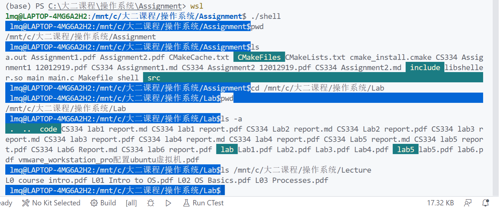

## Simple Shell

在这次的操作系统 Assignment 2 当中，实现了一个简易版的Shell，以下是实现的功能介绍。

### 运行方法（linux 环境）

`cmake .`

`make`

`./shell`

### 基本输出

通过使用 ` get_user_name()` 以及 `gethostname()`获取用户的用户名以及主机名，再通过 `getcwd()` 获取当前所在的路径。

再通过`printf("\033[44;37;5m %s$\033[0m", prefix)`的类似方式，调整控制台输出 ，来模拟真实的 shell 输出效果。

输出结果截图如下所示。

 wsl 运行结果

 虚拟机内运行结果

不失一般性，以下的测试将会使用 wsl 进行测试。

### pwd

通过使用 `getpwd()` 函数，可以得到当前的工作路径。对

```c
// pwd 获取当前工作路径
int pwd_function(char **tokens)
{
    char *path = getcwd(NULL, 0);
    if (path == NULL)
    {
        perror("Fault happens in getcwd()\n");
        return 0;
    }
    printf("%s\n", path);
    free(path); // 释放内存
    return 1;
}
```

下面是功能截图



### ls

对函数的解释见行间注释

```c
// ls 查看当前目录下所有文件
int ls_function(char **tokens)
{
 
    if (tokens == NULL) // 对传入参数进行检查
    {
        perror("Invalid NULL input\n");
        return 1;
    }
    int cnt = 0;
 
    int read_hidden_flag = 0;
    char *path = (char*)malloc(sizeof(char) * 512);
    
    if(!path){
        perror("Failue in allocating for path\n");
        
        return 1;
    }
    
    memset(path, 0, sizeof(char) * 512);
  
    while (tokens[cnt] != NULL) // 对参数个数计数
    {
        cnt++;
    }
    if (cnt > 1 && tokens[1][0] != '-') // 指定路径使用 ls 的情况
    {
        strcpy(path, tokens[1]);
    }
    else if (cnt > 1 && strcmp(tokens[1], "-a") == 0) // -a 输出的情况
    {
        path = "./";
        read_hidden_flag = 1;
    }
    else // 默认路径
    {
        path = "./";
    }
    DIR *dir = opendir(path);

    if (dir == NULL)
    {
        perror("Failure in openning dir\n");
        return 1;
    }
    else
    {
        struct dirent *files = NULL;
        while (files = readdir(dir)) // 遍历目录下所有文件
        {
            if (!read_hidden_flag && files->d_name[0] == '.') // 如果不需要显式隐藏文件则忽略
                continue;
            if (files->d_type == DT_DIR) // 对文件夹进行特别显示
            {
                printf("\033[33;46;5m %s \033[0m", files->d_name); 
            }
            else
            {
                char fullpath[NAME_MAX + 1] = {0};
                sprintf(fullpath, "%s %s", path, files->d_name); //将目录下文件连接到目录路径下
                struct stat st = {0};
                stat(fullpath, &st);
                if (st.st_mode & (S_IXUSR | S_IXGRP | S_IXOTH))
                { //如果目录下文件有执行权限
                    printf("%s ", files->d_name);
                }
                else
                {
                    printf("%s ", files->d_name);
                }
            }
        }
        printf("\n");
        closedir(dir); //关闭目录
        return 0;
    }
}
```

实现功能截图如下：


### cd

对于 cd 切换目录指令的支持，是通过 `chdir()` 函数实现的，如果成功个修改了路径，返回值是0，否则，将会提示用户系统找不到这样的路径。

```c
// cd 切换工作路径
int cd_function(char **tokens)
{

    if (tokens == NULL)
    {
        perror("Invalid input\n");
        return 1;
    }
    if (chdir(tokens[1]) == 0)
    { // 成功
        return 0;
    }
    else
    {// 失败
        printf("-bash: cd: %s: No such file or directory\n", tokens[1]);
        return 1;
    }
}
```


### date

对于 date 的支持，我使用了 `time()`，对得到的时间信息进行处理，拼接，得到一个更为清晰的输出。

```C

// date 获取当前系统时间
int date_function(char **tokens)
{
    time_t time_ptr;
    struct tm *tmp_ptr = NULL;

    time(&time_ptr);

    tmp_ptr = localtime(&time_ptr);

    char year[5], month[2], day[3], hour[3], minute[3], second[3];
    sprintf(year, "%d", (tmp_ptr->tm_year + 1900));
    sprintf(month, "%d", (tmp_ptr->tm_mon + 1));

    sprintf(day, "%d", (tmp_ptr->tm_mday));

    sprintf(hour, "%d", (tmp_ptr->tm_hour));

    sprintf(minute, "%d", (tmp_ptr->tm_min));
    sprintf(second, "%d", (tmp_ptr->tm_sec));

    char *timeline = (char *)malloc(sizeof(char) * 30);
    memset(timeline, 0, sizeof(char) * 30);
    strcat(timeline, year);
    strcat(timeline, "-");
    strcat(timeline, month);
    strcat(timeline, "-");
    strcat(timeline, day);
    strcat(timeline, " ");
    strcat(timeline, hour);
    strcat(timeline, ":");
    strcat(timeline, minute);
    strcat(timeline, ":");
    strcat(timeline, day);
    printf("%s\n", timeline);
    free(timeline);
    return 1;
}

```

实现的功能截图如下所示：


### help

对于一个 shell 而言，help 也是基本的功能之一，这里通过输出本程序实现的内部指令以及支持的外部指令样例，告知用户本 shell 程序的使用方法。

```C
// help 展示内部命令
int help(char **tokens)
{
    printf("GNU bash, version 5.0.17(1)-release (x86_64-pc-linux-gnu)\nThese shell commands are defined internally.  Type `help' to see this list.\n");
    printf("----------------------------------------------------------------------------------\n");
    printf("[pwd] show the current working path\n");
    printf("[echo] print the string again\n");
    printf("[cd] convert to a specified path\n");
    printf("[date] print the current time and date\n");
    printf("[ls] check all the files in currnet directory\n");
    printf("----------------------------------------------------------------------------------\n");
    printf("The above commands are implemented, and you can also try other commands which system can support\n");
    printf("Here are some example commands\n");
    printf("[ps] have a look at all the running process\n");
    printf("[ping] ping to some websites to test the network\n");
    printf("Use the man command for information on other programs.\n");
    printf("Also, my shell supports for simple pipes and redirects\n");
    printf("------------------------------------------------------------------------------------\n");
    printf("Have a good time ~\n");
    return 1;
}
```

功能截图如下：


### echo

对于 echo 的支持，主要是通过对输入的字符串数组进行字符串拼接实现的。

```c
// echo 回显
int echo_function(char **tokens)
{
    if (tokens == NULL)
    {
        perror("Input tokens is NULL\n");
        return 0;
    }

    else
    {
        char *res = (char *)malloc(sizeof(char) * 100);

        if (res == NULL)
        {
            perror("Allocation Fault\n");
            free(res);
            return 0;
        }
        memset(res, 0, sizeof(char) * 100);

        if (tokens[1] == NULL)
        {
            printf("\n");
            free(res);
            return 1;
        }

        int i = 1;

        while (tokens[i] != NULL)
        {
            strcat(res, tokens[i]);
            strcat(res, " ");
            i++;
        }

        printf("%s\n", res);
        free(res);
        return 1;
    }
}
```

功能截图如下：


### exit

通过告知用户退出的消息，然后正常退出程序

```C
// exit 退出 shell 程序
int exit_function(char **tokens)
{
    printf("logout\n");
    free(tokens);
    exit(0);
    return 1;
}
```


### 其余 Shell 指令

其余的比较复杂的 Shell 指令可以通过使用 `fork()`, `exec()` 以及 `wait()` 加以支持。

一般是通过子进程调用 `exec()` 执行对应的外部指令，父进程使用 `wait()` 等待子进程执行。

```C

// 调用外部进程
int outer_process(char **tokens)
{
    int cnt = 0; // tokens 长度
    char *args[3];
    for (int i = 0; i < 3; i++)
    {
        args[i] = NULL;
    }
    while (tokens[cnt] != NULL)
    {
        args[cnt] = tokens[cnt];
        cnt++;
    }

    cnt--;
    int pid = fork();
    if (pid < 0)
    {
        perror("Fork Failure\n");
        return 0;
    }
    else if (pid == 0)
    {

        int flag = execvp(args[0], args);

        if (!flag)
        {
            perror("Wrong command input\n");
            return 0;
        }
    }
    else
    {
        int wc = wait(NULL);
    }
    return 1;
}

```

实现之后，功能截图如下（进行了 `ps -al`， `wc`，`uname`， `ping` ，`clear`的测试）：


### Pipe 管道

Pipe 管道的实现稍微复杂，主要原理是通过改变标准输入输出流的位置，将其设置为输入管道的位置。这部分通过`pipe()` 函数以及 `dup2()`函数进行实现。本程序中，使用子进程的输出作为父进程管道的输入，所以父进程调用 `wait`等待子进程执行完毕。

在程序内部，为了保证程序的鲁棒性，需要不断地确认参数的合法性以及需要确认内存被正常分配，最后也要确认内存是否完全释放，避免内存泄露。

程序运行完毕之后，确认恢复标准输入输出流，否则会导致后续的 shell 程序无法读入命令。

```c

// pipe 管道, 返回 0代表没有管道，-1代表进程失败，1代表管道执行成功
int pipe_function(char *line){
    int size = strlen(line);
    int pipe_idx = -1;
    for(int i = 0; i < size; i++){
        if (line[i] == '|'){
            pipe_idx = i;
        }
    }
    if(pipe_idx == -1){ // 表示原指令当中没有管道标志
        return 0;
    }else{
        if(line[pipe_idx - 1] != ' ' || (pipe_idx == size - 1 || line[pipe_idx + 1] != ' ')){ // 表示管道不合法，直接退出程序
            perror("Invalid pipe, missing parameter\n");
            return -1;
        }
    }
    int point[2];
    int success = pipe(point);
    if(success == -1){ // 创建失败
        return -1;
    }
    int pid = fork();

    if(pid < 0){
        perror("Failure fork\n");
        return -1;
    }else if(pid == 0){ // 子进程
       
        close(point[0]); // 关闭读
     
        int s_out = dup(STDOUT_FILENO);
        dup2(point[1], STDOUT_FILENO); // 直接使得标准输出流也指向 point[1]指向的句柄，也就是管道的另一头
        
        close(point[1]);
        // 将管道左边的指令切割下来
        char *left_com = (char *)malloc(sizeof(char) * 512);
        if(left_com == NULL){
            perror("Failure in allocating\n");
            return -1;
        }
        memset(left_com, 0, sizeof(char) * 512);
        for(int i = 0; i < pipe_idx - 1; i++){
            left_com[i] = line[i];
        }
        // printf("The left command is %s\n", left_com);
        char **tokens = split(left_com);
        if(execute(tokens) != 1){
            free(tokens);
            free(left_com);
            return -1;
        }
        free(left_com);
        free(tokens);
        dup2(s_out, STDOUT_FILENO); // 恢复标准输出缓冲区
        exit(0);
    }else{// 父进程
        wait(NULL);
  
        close(point[1]);
        int s_in = dup(STDIN_FILENO);
        dup2(point[0], STDIN_FILENO); // 将管道0作为命令的输入
        close(point[0]);
        int cnt = 0;
        char* right_com = (char*)malloc(sizeof(char) * 512);
        if(right_com == NULL){
            perror("Failure in allocating\n");
            return -1;
        }
        memset(right_com, 0, sizeof(char) * 512);
        
        for(int i = pipe_idx + 2; i < size; i++){
            right_com[cnt++] = line[i];
        }


        char **tokens = split(right_com);
        if(execute(tokens) != 1){
            free(tokens);
            free(right_com);
            return -1;
        }

        free(right_com);
        free(tokens);
        dup2(s_in, STDIN_FILENO); // 恢复标准输入缓冲区
    }
    return 1;
    
}
```

截图和 FIFO 重定向一并展示

### FIFO 重定向

输入输出重定向原理和管道的实现类似，在重定向当中，使用 `freopen()`函数改变输入输出流，定向到文件当中。

```C

// redirect 重定向, -1 表示不合法，0 表示没有重定向，1 表示合法调用重定向
int redirect_function(char * line){
    
    int size = strlen(line);

    int output_flag = 0;

    int output_idx = size;

    char *output_file = (char*) malloc(sizeof(char) * 256);
    if(output_file == NULL){
        perror("Allocation failure\n");
    
        return -1;
    }
    char *command = (char*) malloc(sizeof(char) * 32);
    
   
    // 初始化
    // memset(input_file, 0, sizeof(char) * 32);
    memset(output_file, 0, sizeof(char) * 256);
    memset(command, 0, sizeof(char) * 32);

    for(int i = 0; i < size; i++){

        if(line[i] == '>'){
            output_flag = 1;
            output_idx = i;
            if(i == size - 1 || i == size - 2){
                perror("Missing parameter\n");
           
                free(output_file);
                return -1;
            }
        }

    }
    if(!output_flag){
        return 0;
    }
    for(int i = 0; i < output_idx - 1; i++){
        command[i] = line[i];
    }
    int cnt = 0;
    for(int i = output_idx + 2; i < size; i++){
        output_file[cnt++] = line[i];
    }

    int rc = fork();
 
    if(rc < 0){
        perror("Fork Failure\n");

        free(output_file);
        return -1;
    }else if(rc == 0){ // 子进程
        
        if(output_flag){
            freopen(output_file, "w", stdout); 
        }
       
        
        char ** tokens = split(command);
        int status = execute(tokens);
        if(status != 1){
            // free(input_file);
            free(output_file);
            free(tokens);
            exit(1);
            return -1;
        }
        // free(input_file);
        free(tokens);
        free(output_file);
        free(command);
        
        exit(0);

    }else{ // 父进程
        wait(NULL);

    }

    free(output_file);
    free(command);
    return 1;    
}

```

和Pipe 管道的功能实现截图如下：


运行之后，两个文件内容截图如下：


实现了基本的管道输出以及FIFO重定向功能。

以上就是本次 shell 实现的所有内容。
